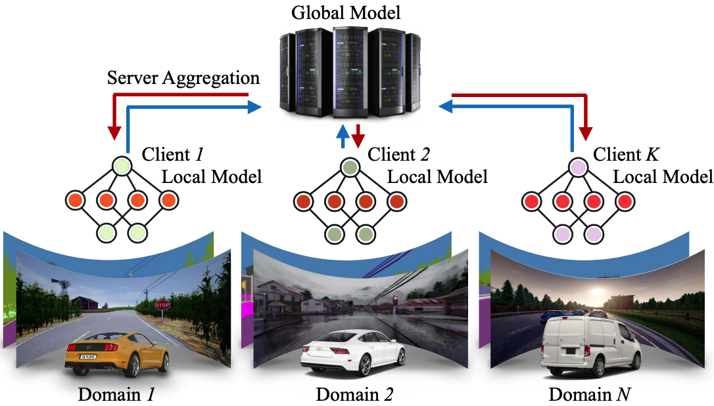

# FedDrive: Generalizing Federated Learning to Semantic Segmentation in Autonomous Driving

**Official implementation** of [FedDrive: Generalizing Federated Learning to Semantic Segmentation
in Autonomous Driving](https://arxiv.org/abs/2202.13670) 

by **Lidia Fantauzzo**<sup>\*,1</sup>, **Eros Fanì**<sup>\*,1</sup>, Debora Caldarola<sup>1</sup>,
Antonio Tavera<sup>1</sup>, Fabio Cermelli<sup>1,2</sup>, Marco Ciccone<sup>1</sup>, Barbara Caputo<sup>1</sup>. 

**Official Website:** [https://feddrive.github.io/](https://feddrive.github.io/).

**Corresponding authors:** lidia.fantauzzo@studenti.polito.it, eros.fani@polito.it.

<sup>\*</sup>Equal contribution. <sup>1</sup>All the authors are supported by Politecnico di Torino, Turin, Italy. 
<sup>2</sup>Fabio Cermelli is with Italian Institute of Technology, Genoa, Italy.



## Citation

If you find our work relevant to your research, or use this code, please cite our IROS 2022 paper:

```
@inproceedings{feddrive2022,
  title={FedDrive: Generalizing Federated Learning to Semantic Segmentation in Autonomous Driving},
  author={Fantauzzo, Lidia and Fanì, Eros and Caldarola, Debora and Tavera, Antonio and Cermelli, Fabio and Ciccone, Marco and Caputo, Barbara},
  booktitle={Proceedings of the 2022 IEEE/RSJ International Conference on Intelligent Robots and Systems},
  year={2022}
}
```

## Summary

FedDrive is a new benchmark for the Semantic Segmentation task in a Federated Learning scenario for self-driving cars.
It consists of three settings and two datasets, incorporating the real-world challenges of statistical heterogeneity
and domain generalization. FedDrive is a benchmark of state-of-the-art algorithms and style transfer methods taken from
the Federated Learning, Domain Generalization, and Domain Adaptation literature, whose objective is to improve the
generalization ability and robustness statistical heterogeneity robustness of the model. We demonstrate that correctly
handling normalization statistics is crucial to deal with the aforementioned challenges. Furthermore, style transfer
dramatically improves performance when dealing with significant appearance shifts.

## Setup

1) Clone this repository

2) Move to the root path of your local copy of the repository

3) Create the ```feddrive``` new conda virtual environment and activate it:
```
conda env create -f environment.yml
conda activate feddrive
```

4) Download the Cityscapes dataset from [here](https://www.cityscapes-dataset.com/downloads/).
You may need a new account if you do not have one yet. Download the ```gtFine_trainvaltest.zip``` and ```leftImg8bit_trainvaltest.zip```archives

5) Extract the archives and move the ```gtFine``` and ```leftImg8bit``` folders in ```[local_repo_path]/data/cityscapes/data/```

6) Ask for the ```IDDA V3``` version of IDDA, available [here](https://idda-dataset.github.io/home/download/)

7) Extract the archive and move the ```IDDAsmall``` folder in ```[local_repo_path]/data/idda/data/```

8) Make a new [wandb](https://wandb.ai/) account if you do not have one yet, and create a new wandb project.

9) In the ```configs``` folder, it is possible to find examples of config files for some of the experiments to replicate the results of the paper.
Run one of the exemplar configs or a custom one:
```
./run.sh [path/to/config]
```
N.B. change the ```wandb_entity``` argument with the entity name of your wandb project.

N.B. always leave a blank new line at the end of the config. Otherwise, your last argument will be ignored.

## Results

### Cityscapes

| Method           | mIoU &pm; std (%)   |
|------------------|---------------------|
| FedAvg (uniform) | 45.71 &pm; 0.37     |
| FedAvg           | 43.85 &pm; 1.24     |
| FedAvg + CFSI    | 41.50 &pm; 0.98     |
| FedAvg + LAB     | 39.20 &pm; 1.37     |
| **SiloBN**       | **44.20 &pm; 1.43** |
| SiloBN + CFSI    | 40.48 &pm; 1.40     |
| SiloBN + LAB     | 42.23 &pm; 1.23     |

### IDDA

The *seen* and *unseen* columns refer to the results for the test client that contains images from the same training
domains and to the test client that contains images from other domains, respectively. Results are reported in the form
mIoU &pm; std (%).

| Method           | Setting     | seen                | unseen              |
|------------------|-------------|---------------------|---------------------|
| FedAvg (uniform) | country     | 63.57 &pm; 0.60     | 49.74 &pm; 0.79     |
| FedAvg           | country     | 42.43 &pm; 1.78     | 40.01 &pm; 1.26     |
| FedAvg + CFSI    | country     | 54.70 &pm; 1.12     | 45.70 &pm; 1.73     |
| FedAvg + LAB     | country     | 56.59 &pm; 0.90     | 45.68 &pm; 1.04     |
| FedBN            | country     | 54.39               | -                   |
| SiloBN           | country     | 58.82 &pm; 2.93     | 45.32 &pm; 0.90     |
| SiloBN + CFSI    | country     | 61.22 &pm; 3.88     | 49.17 &pm; 1.01     |
| **SiloBN + LAB** | **country** | **64.32 &pm; 0.76** | **50.43 &pm; 0.63** |
| FedAvg           | rainy       | 62.72 &pm; 3.35     | 27.61 &pm; 2.80     |
| FedAvg + CFSI    | rainy       | 38.18 &pm; 1.40     | 26.75 &pm; 2.32     |
| FedAvg + LAB     | rainy       | 55.24 &pm; 1.65     | 31.05 &pm; 2.68     |
| FedBN            | rainy       | 56.45               | -                   |
| SiloBN           | rainy       | 62.48 &pm; 1.42     | 50.03 &pm; 0.79     |
| SiloBN + CFSI    | rainy       | 63.04 &pm; 0.31     | 50.54 &pm; 0.88     |
| **SiloBN + LAB** | **rainy**   | **65.85 &pm; 0.91** | **53.99 &pm; 0.79** |


## How to visualize model predictions, LAB and CFSI images

The script ```plot_samples.py``` is designed to save and eventually visualize
sets of ```(image, CFSI(image), LAB(image), target, model(image))```
from samples in the test set(s) associated with a dataset, given a checkpoint
and the indices of the images to show.

To use this script:

1) Download the checkpoint of the desired run from WandB
2) Copy the ```[run_args]``` from the info of the same run on wandb
3) Customize the load_path, indices, path_to_save_folder and plot variables options
4) Modify the ```CUDA_VISIBLE_DEVICES``` environment variable to select one single desired GPU 
5) Move to the root directory of this repository and run the following command:
```
python src/plot_samples.py [run_args]
```
